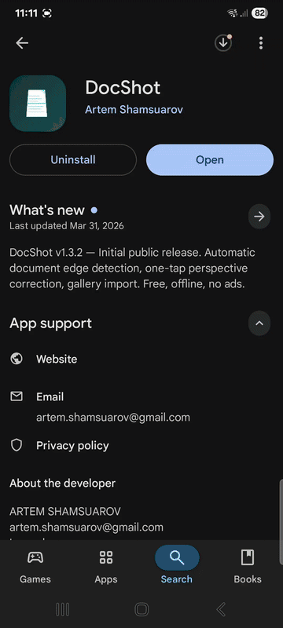

# DocShot

Zero-tap document scanning for Android. Point your camera at a document — DocShot automatically detects the boundary, captures when stable, corrects perspective distortion, and saves a clean rectangular image. No corner dragging, no multi-step workflows.

<p align="center">
  <a href="https://play.google.com/store/apps/details?id=com.docshot"></a>
</p>

<p align="center">
  
  <br>
  <a href="https://youtube.com/shorts/PlQEvZvwrHc">▶ Watch full demo</a>
</p>

## Motivation

Every phone has a document scanner buried 3 taps deep in the camera app, and it still asks you to adjust corners manually. I wanted something faster: open the app, point at a document, get a clean scan. The kind of tool I'd actually use daily instead of just knowing it exists somewhere in my phone's settings.

## Features

- **Zero-tap auto-capture** — Detects document stability across 20 consecutive frames, locks autofocus, then captures automatically
- **Real-time preview** — Live quadrilateral overlay tracking the detected document boundary at 30fps
- **Perspective correction** — Sub-pixel corner refinement + homography warp produces a clean rectangular output
- **Orientation detection** — Sobel gradient + ink-density analysis ensures the result is right-side up
- **Aspect ratio adjustment** — Defaults to A4, auto-snaps to common formats (A4, US Letter, ID card, business card) with manual slider override, verified via homography decomposition
- **Aspect ratio lock** — Lock your chosen ratio so it persists across successive scans of same-format documents
- **Gallery import** — Rectify existing photos with automatic detection or manual corner adjustment
- **Manual corner adjustment** — Draggable handles with magnifier loupe when auto-detection needs help
- **Post-processing filters** — B&W (adaptive threshold), High Contrast (CLAHE), Even Light (gradient correction for angled lighting)
- **Auto white balance** — Gray-world per-channel correction for outdoor color cast, toggleable per result
- **Flash control** — Torch toggle for low-light scanning, persisted across sessions and across captures (re-enables automatically after each scan)
- **Confidence-gated capture** — High confidence goes straight to result; low confidence routes to manual adjustment; very low is suppressed entirely
- **Multi-strategy detection** — 11 preprocessing strategies with scene analysis, white-on-white detection, and LSD+Radon cascade fallback
- **Low-contrast & white-on-white detection** — DOG, gradient magnitude, directional gradient (JNI-accelerated), and LSD+Radon cascade for documents on near-white surfaces
- **First-launch onboarding** — 3-page interactive walkthrough introducing camera detection, auto-capture, and result screen features
- **Localization-ready** — All UI strings externalized to `strings.xml` for easy translation
- **In-app privacy policy & feedback** — Direct links in Settings to privacy policy and GitHub Issues

<p align="center">
  
  &nbsp;&nbsp;
  
</p>

## How It Works

Classical computer vision pipeline — no ML models, no cloud services:

1. **Scene analysis** — Histogram-based assessment selects optimal preprocessing strategy
2. **Preprocessing** — Adaptive Gaussian blur + strategy-specific enhancement (CLAHE, bilateral, morphological closing)
3. **Edge detection** — Canny with automatic threshold selection from median pixel intensity
4. **Contour extraction** — External contours approximated to polygons, scored by area, convexity, angle regularity, aspect ratio, and edge density
5. **Line suppression** — HoughLinesP detects image-spanning lines (tile grout, table seams), zero-strips them to prevent contour fusion
6. **Corner refinement** — Sub-pixel corner detection (`cornerSubPix`) on the best quadrilateral candidate
7. **Homography & warp** — `getPerspectiveTransform` + `warpPerspective` (INTER_CUBIC) to a properly-sized output rectangle
8. **Post-processing** — Optional filtering (B&W, contrast, lighting correction, white balance) on the rectified result

## Tech Stack

- **Language:** Kotlin + C++ (JNI for hot paths)
- **UI:** Jetpack Compose + Material 3
- **Camera:** CameraX with Camera2 interop (autofocus control, intrinsics extraction)
- **Computer Vision:** OpenCV Android SDK 4.12
- **Build:** Gradle Kotlin DSL, AGP 8.7, NDK 27
- **Min SDK:** 24 (Android 7.0) / **Target SDK:** 34

## Building

```bash
# Clone
git clone https://github.com/Artemarius/DocShot.git
cd DocShot

# Build debug APK
./gradlew assembleDebug

# Install on connected device
./gradlew installDebug

# Run tests
./gradlew testDebugUnitTest

# Build signed release AAB (requires keystore.properties — see keystore.properties.template)
./gradlew bundleRelease
```

**Requirements:**
- Android Studio Hedgehog (2023.1.1) or later
- Android SDK 34 + NDK 27
- OpenCV Android SDK 4.12 (set `OPENCV_ANDROID_SDK` environment variable)
- Physical device recommended (camera features don't work in emulator)

## Architecture

```
app/src/main/java/com/docshot/
├── ui/              # Compose screens + navigation
│   ├── CameraScreen       # Camera preview, quad overlay, auto-capture UX
│   ├── ResultScreen        # Before/after view, filters, aspect ratio, save/share
│   ├── CornerAdjustScreen  # Manual corner handles + magnifier loupe
│   ├── OnboardingScreen    # First-launch 3-page walkthrough
│   ├── GalleryScreen       # Photo picker + gallery import flow
│   └── SettingsScreen      # Preferences, about section, privacy/feedback links
├── camera/          # CameraX setup, frame analysis, AF control
├── cv/              # Document detection, rectification, post-processing
│   ├── DocumentDetector    # Multi-strategy preprocessing + contour pipeline
│   ├── EdgeDetector        # Line suppression, edge-spanning line detection
│   ├── LsdRadonDetector    # LSD+Radon cascade for ultra-low-contrast scenes
│   ├── QuadRanker          # Candidate scoring + confidence computation
│   ├── QuadSmoother        # Temporal smoothing + stability detection
│   ├── Rectifier           # Homography + warp + aspect ratio adjustment
│   └── PostProcessor       # Filters (B&W, contrast, even light, white balance)
└── util/            # Permissions, image I/O, gallery save, DataStore prefs

app/src/main/cpp/    # NDK native code (libdocshot_native.so)
├── directional_gradient.cpp  # C++ hot loop for DIRECTIONAL_GRADIENT
└── jni_bridge.cpp            # JNI entry point (zero-copy array pinning)

app/src/main/res/
└── values/strings.xml  # All UI strings (i18n-ready)
```

## Performance

| Metric | Target | Measured (Galaxy S21) |
|--------|--------|-----------------------|
| Detection latency | < 30ms/frame | ~15ms typical |
| Full capture pipeline | < 200ms | ~120ms |
| APK size (arm64) | < 30MB | 26MB |
| Memory usage | < 150MB | ~100MB typical |

## Testing

69 instrumented tests + unit tests covering:
- Corner ordering and quad scoring
- Confidence computation and edge density validation
- Aspect ratio scoring against known document formats
- Contour analysis (partial documents, small documents)
- Synthetic image regression tests (low contrast, shadows, colored backgrounds, noise, overexposure)
- Low-contrast benchmarks (white-on-white, ultra-low-contrast, strategy broadening)
- Line suppression (grout lines, tile floors, spanning lines)

## Privacy

DocShot processes everything on-device. No internet connection, no accounts, no analytics, no data collection. [Privacy Policy](https://artemarius.github.io/DocShot/privacy-policy.html)

## License

MIT
